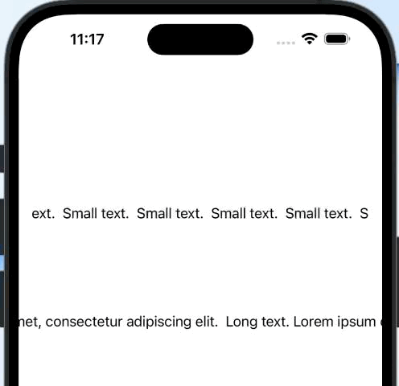

# SwiftContinuousScrollingView
`ContinuousScrollingView` is a custom UIView subclass designed to create a scrolling effect for text.
## Overview
`ContinuousScrollingView` provides a convenient way to display scrolling text within a UIView. It is useful for showcasing text content that exceeds the width of the view's bounds, allowing the text to continuously scroll horizontally. It can be used in any scroll view-type class (in a tableview/collectionview as a cell).



## Features

- Seamless integration with existing UIView-based layouts.
- Customizable text content, font, and text color.
- Smooth and continuous scrolling animation.
- Easy-to-use API for starting and configuring the scrolling behavior.

## Usage

1. Import the `ContinuousScrollingView` class into your project.
2. Create an instance of `ContinuousScrollingView` and add it to your view hierarchy.
3. Set the `textToScroll`, `font`, and `textColor` properties to customize the appearance of the scrolling text.
4. Call the `startAnimations()` method to initiate the scrolling animation.

```swift
import UIKit
import ContinuousScrollingView

class ViewController: UIViewController {
    
    // Create an instance of ContinuousScrollingView
    let scrollingView = ContinuousScrollingView()
    
    override func viewDidLoad() {
        super.viewDidLoad()
        
        // Customize the scrolling text
        scrollingView.textToScroll = "Lorem ipsum dolor sit amet, consectetur adipiscing elit."
        scrollingView.font = UIFont.systemFont(ofSize: 40.0)
        scrollingView.textColor = .black
        scrollingView.textBackgroundColor = .red
        scrollingView.viewBackgroundColor = .blue
        scrollingView.delay = 0.2
        scrollingView.duration = 10

        // Add the scrolling view to your view hierarchy
        view.addSubview(scrollingView)
        scrollingView.translatesAutoresizingMaskIntoConstraints = false
        NSLayoutConstraint.activate([
            scrollingView.centerYAnchor.constraint(equalTo: view.centerYAnchor),
            scrollingView.leadingAnchor.constraint(equalTo: view.leadingAnchor),
            scrollingView.trailingAnchor.constraint(equalTo: view.trailingAnchor),
        ])

        // Start the scrolling animation
        scrollingView.startAnimations()
    }
}

```
## Requirements

- iOS 11.0+
- Swift 5.0+

## Installation

### Swift Package Manager

You can use Swift Package Manager to integrate `ContinuousScrollingView` into your Xcode project. Follow these steps:

1. In Xcode, select **File > Swift Packages > Add Package Dependency...**
2. Enter the URL of this repository: https://github.com/deniz-yuce/SwiftContinuousScrollingView.git
3. Follow the prompts to specify the version and location for the package.
4. Click **Finish** to add the package to your project.

## License

`ContinuousScrollingView` is available under the MIT license. See the [LICENSE](LICENSE) file for more information.

---
